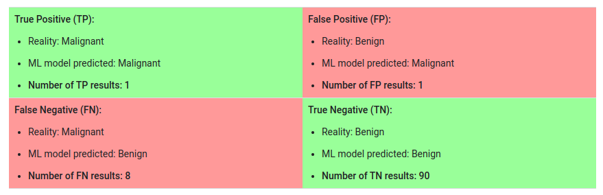

# Classification.
This module shows how logistic regression can be used for classification tasks, and explores how to evaluate the effectiveness of classification models.

## Thresholding
Logistic regression returns a probability. You can use the returned probability "as is" (for example, the probability that the user will click on this ad is 0.00023) or convert the returned probability to a binary value (for example, this email is spam).

A logistic regression model that returns 0.9995 for a particular email message is predicting that it is very likely to be spam. Conversely, another email message with a prediction score of 0.0003 on that same logistic regression model is very likely not spam. However, what about an email message with a prediction score of 0.6? In order to map a logistic regression value to a binary category, you must define a classification threshold (also called the decision threshold). A value above that threshold indicates "spam"; a value below indicates "not spam." It is tempting to assume that the classification threshold should always be 0.5, but thresholds are problem-dependent, and are therefore values that you must tune.

## True VS False and Positive VS Negative
A true positive is an outcome where the model correctly predicts the positive class. Similarly, a true negative is an outcome where the model correctly predicts the negative class.

A false positive is an outcome where the model incorrectly predicts the positive class. And a false negative is an outcome where the model incorrectly predicts the negative class.

## Accuracy
Accuracy is one metric for evaluating classification models. Informally, accuracy is the fraction of predictions our model got right. Formally, accuracy has the following definition:
>- $$accuracy = \frac{number of correct predictions}{total number of predictions}$$

For binary classification problems, accuracy can also be calculated in terms of positives and negatives as follows:
>- $$accuracy = \frac{TP+TN}{TP+TN+FP+FN}$$
>- where:
>- $$TP$$
>- is the number of true positives.
>- $$TN$$
>- is the number of true negatives.
>- $$FP$$
>- is the number of false positives.
>- $$FN$$
>- is the number of false negatives.

Let's try calculating accuracy for the following model that classified 100 tumors as malignant(the positive class) or benign(the negative class):

 $$ Accuracy = \frac{90+1}{90+1+1+8} = 0.91$$

 Accuracy comes out to 0.91, or 91% (91 correct predictions out of 100 total examples). That means our tumor classifier is doing a great job of identifying malignancies, right?

Actually, let's do a closer analysis of positives and negatives to gain more insight into our model's performance.

Of the 100 tumor examples, 91 are benign (90 TNs and 1 FP) and 9 are malignant (1 TP and 8 FNs).

Of the 91 benign tumors, the model correctly identifies 90 as benign. That's good. However, of the 9 malignant tumors, the model only correctly identifies 1 as malignant—a terrible outcome, as 8 out of 9 malignancies go undiagnosed!

While 91% accuracy may seem good at first glance, another tumor-classifier model that always predicts benign would achieve the exact same accuracy (91/100 correct predictions) on our examples. In other words, our model is no better than one that has zero predictive ability to distinguish malignant tumors from benign tumors.

Accuracy alone doesn't tell the full story when you're working with a class-imbalanced data set, like this one, where there is a significant disparity between the number of positive and negative labels.

## Precision and Recall
### Precision
Precision is a measure of a classifier's exactness. The higher the precision, the more accurate the classifier.
Precision is defined as follows:
>- $$precision = \frac{TP}{TP+FP}$$
Precion attempts to answer the following question:
>- What proportion of positive identifications was actually correct?

### Recall
Recall is a measure of a classifier's completeness. The higher the recall, the more cases the classifier covers.
Recall is defined as follows:
>- $$recall = \frac{TP}{TP+FN}$$
Recall attempts to answer the following question:
>- What proportion of actual positives was identified correctly?

Precision and recall are often in tension. That is, improving precision typically reduces recall and vice versa. In other words, there is a tradeoff between precision and recall.

## ROC Curve and AUC
### ROC Curve
A receiver operating characteristic curve, or ROC curve, is a graphical plot that illustrates the diagnostic ability of a binary classifier system as its discrimination threshold is varied. The ROC curve is created by plotting the true positive rate (TPR) against the false positive rate (FPR) at various threshold settings.

TPR is a synonym for recall and FPR is a synonym for fall-out.

TPR is defined as follows:
>- $$TPR = \frac{TP}{TP+FN}$$
>- where:
>- $$TP$$
>- is the number of true positives.
>- $$FN$$
>- is the number of false negatives.

FPR is defined as follows:
>- $$FPR = \frac{FP}{FP+TN}$$
>- where:
>- $$FP$$
>- is the number of false positives.
>- $$TN$$
>- is the number of true negatives.

An ROC curve plots TPR vs. FPR at different classification thresholds. Lowering the classification threshold classifies more items as positive, thus increasing both False Positives and True Positives.

To compute the points in an ROC curve, we could evaluate a logistic regression model many times with different classification thresholds, but this would be inefficient. Fortunately, there's an efficient, sorting-based algorithm that can provide this information for us, called AUC.

### AUC: Area Under the ROC Curve
The AUC, or Area Under the ROC Curve, is a measure of how well a binary classification model performs, based on the ROC curve. It is calculated as follows:
>- $$AUC = \frac{1}{2} \sum_{i=1}^{n-1} (x_{i+1}-x_i)(y_i+y_{i+1})$$

AUC is desired for the following reasons:
>- AUC is scale-invariant. It measures how well predictions are ranked, rather than their absolute values.
>- AUC is classification-threshold-invariant. It measures the quality of the model's predictions irrespective of what classification threshold is chosen.

However AUC is not always desired for the following reasons:
>- Scale invariance is not always desirable. For example, sometimes we really do need well calibrated probability outputs, and AUC won't tell us about that.
>- Classification-threshold invariance is not always desirable. For example, in cases where there are wide disparities between the costs of false negatives and false positives, it may be critical to minimize one type of classification error. For example, when doing email spam detection, it's probably better to have some spam get through to your inbox (a false negative) than to have some nonspam email automatically deleted (a false positive). AUC isn't a useful metric for this type of optimization.

## Predicition Bias
Logic regression prediction should be unbiased.That is:
>- $$E[\hat{y}] = y$$
>- where:
>- $$E[\hat{y}]$$
>- is the expected value of the predicted label.
>- $$y$$
>- is the true label.

OR said another way:
> "Average prediction should be equal to the average of observations."

Prediction bias is a quantity that measures how far apart the two averages are.That is:
>- $$ predition bias=average of prediction-average of labels in dataset $$

A significant nonzero prediction bias tells you there is a bug somewhere in your model, as it indicates that the model is wrong about how frequently positive labels occur.

Possible root cause of Prediction Bias:
>- Incomplete Feature Set
>- Noisy data set.
>- Buggy pipeline.
>- Biased training sample.
>- Overly strong regularization.

You might be tempted to correct prediction bias by post-processing the learned model—that is, by adding a calibration layer that adjusts your model's output to reduce the prediction bias. For example, if your model has +3% bias, you could add a calibration layer that lowers the mean prediction by 3%. However, adding a calibration layer is a bad idea for the following reasons:
>- You are fixing the system rather than the cause
>- You have built a more brittle system that you must now kee upto date.

If possible, avoid calibration layers. Projects that use calibration layers tend to become reliant on them—using calibration layers to fix all their model's sins. Ultimately, maintaining the calibration layers can become a nightmare.

## Bucketing and Prediction Bias.
Logistic regression predicts a value between 0 and 1. However, all labeled examples are either exactly 0 (meaning, for example, "not spam") or exactly 1 (meaning, for example, "spam"). Therefore, when examining prediction bias, you cannot accurately determine the prediction bias based on only one example; you must examine the prediction bias on a "bucket" of examples. That is, prediction bias for logistic regression only makes sense when grouping enough examples together to be able to compare a predicted value (for example, 0.392) to observed values (for example, 0.394).

You can form buckets in the following way:
>- Linearly breaking up the target predicitons.
>- Forming Quantiles.

Some of the possibilities as to why prediciton are so poor fo only part of the model:
>- The training set does not actually represent certain subset of the data space.
>- Some subsets of the data set are noiser than the others.
>- The model is overly regularized.
